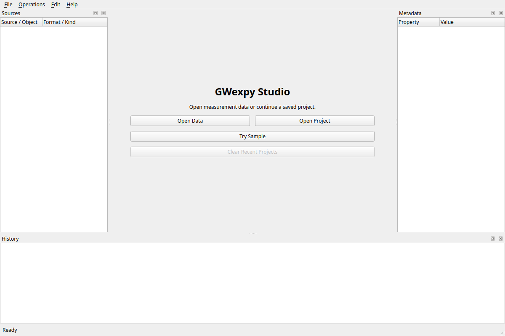
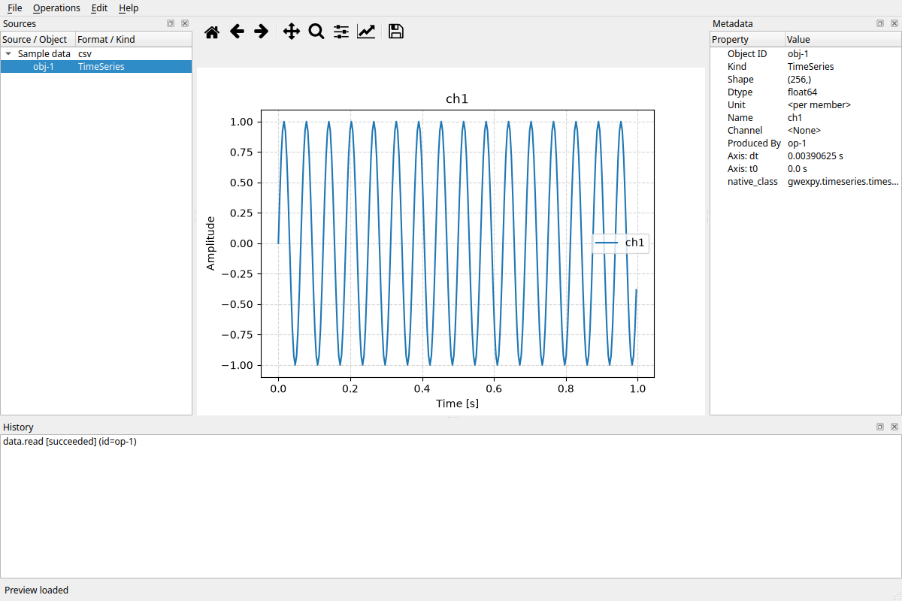
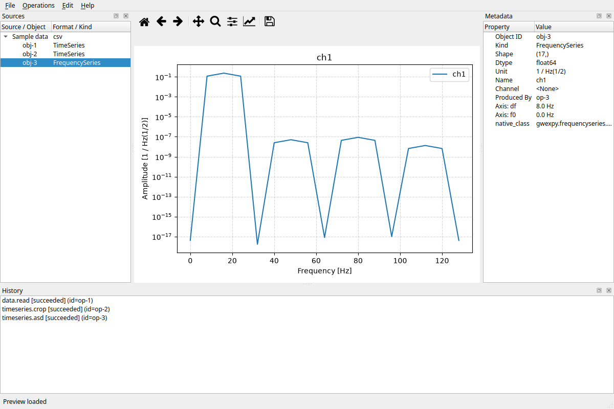
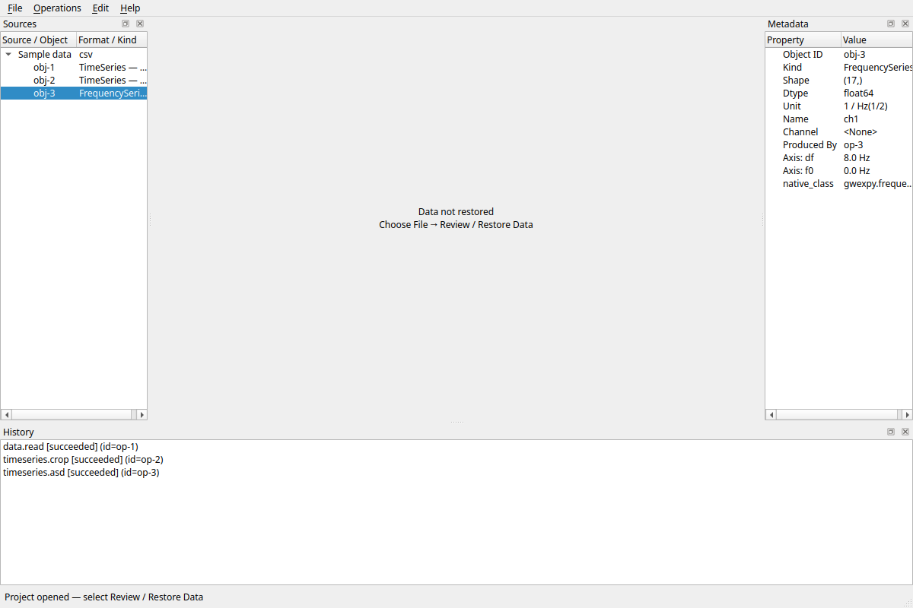

# GWexpy Studio

[日本語](README.ja.md)

GWexpy Studio is a desktop GUI for inspecting scientific data, running GWexpy analysis, saving a project, and exporting ordinary Python.

It is intended for researchers and students who use Python tools but do not need to learn Git or begin by writing a notebook.

## Start with the installation guide

The [installation guide](docs/installation.md) takes you from either a validated trial build or a source checkout to the first workflow on one page.
Use a platform Quick Start only when you need the detailed qualification or diagnostic record bundled with a release.

- For a validated trial build, download the matching ZIP and checksum, then choose one platform section in the installation guide.
- For this source checkout, create a Python 3.12 virtual environment and run python -m pip install ..

The trial route uses a prebuilt wheel and qualified constraints.
The source route resolves the package dependencies for development or local evaluation.

## Trial distribution

Invited participants receive one explicitly shared GitHub prerelease link.

Download the ZIP and checksum sidecar with the same Build ID, verify both the outer and inner checksums, and then continue with the matching platform section in the installation guide.

The currently published prerelease is limited to native Ubuntu 24.04 x86_64 with conda Python 3.12.
WSL2 and macOS are available only when the matching asset is included in the same Release and has passed qualification.

Git, a source checkout, an editable install, and PyPI are not part of the trial route.
Do not replace the trial wheel install with python -m pip install ., change its constraints, or build a dependency from source.

## First five minutes

After installation, follow this sequence:

1. Launch Studio.
2. Select **Try Sample**.
3. Load and crop the TimeSeries.
4. Run **ASD**.
5. Save the project, close Studio, and reopen it.

The installation guide shows the same flow with four real application screenshots.

View the four workflow screens

Projects use the .gwxproj extension.

They record source references, operations, active state, view state, and scientific Undo/Redo position.
Source data and computed arrays stay outside the project file.

## I/O availability

Registered GWexpy formats are not automatically available in a trial build.

The UI will present each data type, format, and direction as one of:

- **Verified**: reviewed policy and a worker-process runtime probe both pass.
- **Experimental**: the runtime probe passes, with a stated caveat.
- **Unavailable**: the policy, registry, or runtime dependency does not allow it.

The effective capability snapshot is included in path-free diagnostics.

## Roadmap and source development

[ROADMAP.md](ROADMAP.md) defines the public-source, Ubuntu reference, WSL2, macOS, and cross-platform human-trial milestones.

The source is [MIT licensed](LICENSE).

Contributors who intentionally want a development environment should read the [installation guide](docs/installation.md) and [development guide](docs/development.md).

The public trial contract is in [docs/release/0.1.0a1-trial-readiness.md](docs/release/0.1.0a1-trial-readiness.md).
